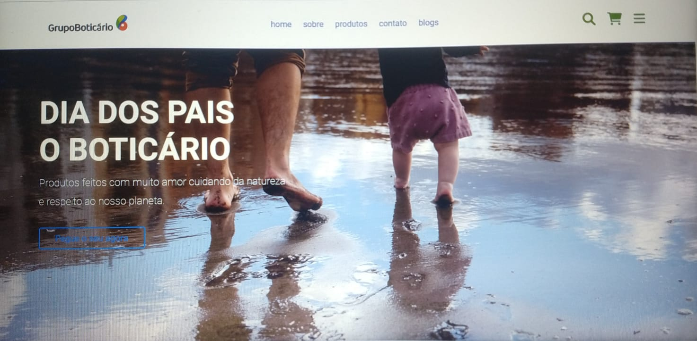

# Dia dos Pais O Boticário
---
## Página Comercial, homenagem ao dia dos pais.

:heavy_check_mark: HTML  
:heavy_check_mark: CSS  
:heavy_check_mark: JavaScript

Fiz esse projeto, para colocar em prática os conhecimentos que venho adquirindo sobre páginas responsivas, para todos os dispositivos de tela. 
  Escolhi como tema o dia dos pais que é comemorado neste mês.
   
  Coloquei também minhas habiliades de marketing.Fiz uma copy sobre o  grupo Boticário homenagando os pais,reforçando os cuidados que tem com as pessoas, com a natureza e com o nosso planeta.  
   A página também faz o comercial do perfume Malbec,carro chefe da linha na  perfumaria masculina .

## Pré-Visualização do projeto: 
[Página dia dos pais O Botiáio](https://dia-dos-pais-oboticario.netlify.app/)

 